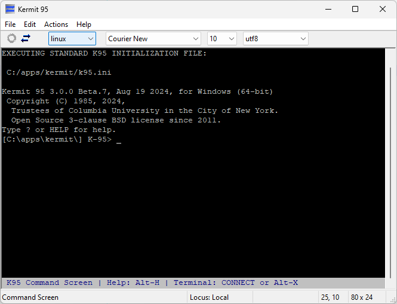
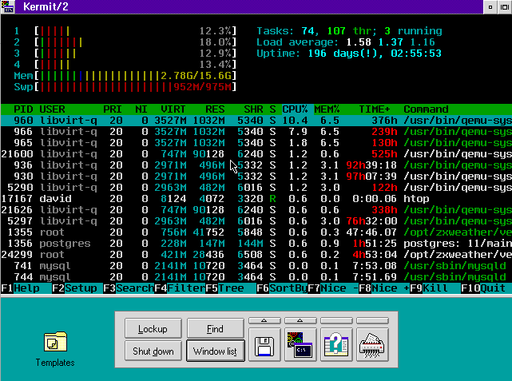

Kermit 95 (C-Kermit for Windows and OS/2)
=========================================

This is Kermit 95, the Windows and OS/2 port of C-Kermit from the Kermit Project.
Kermit 95 was formerly a commercial product of Columbia University from 1994 
to 2011 (versions up to 2.1.3) and since 2013 has been developed under the 
3-clause BSD license. For more information on Kermit, visit the Kermit Project 
website: http://www.kermitproject.org, or see the 
[Kermit 95 3.0 Beta website](https://www.kermitproject.org/ckw10beta.html).



Major features include:
 * More than [40 terminal emulations](#supported-terminal-emulations) - not just VT100 or "xterm"!
 * Support for SSH, Serial port, named pipe, PTY, modem (TAPI or 
   direct), Telnet (TLS, Kerberos, DES/CAST encryption, X11 forwarding and
   RFC2217), and rlogin. Additionally, LAT and CTERM are supported if you've got
   Pathworks installed, and NetBIOS is supported on OS/2.
 * Runs on nearly all 32bit and 64bit Windows releases regardless of CPU
   architecture (SSH and secure telnet/ftp/http require Windows XP or newer).
 * Scriptable file transfer via Kermit, X/Y/Z Modem, HTTP, HTTPS, FTP and FTPS protocols
 * Same command/script language as 
   [C-Kermit on Linux/UNIX/MacOS](https://www.kermitproject.org/ckermit.html), 
   and very similar to Kermit implementations 
   [on MS-DOS](https://kermitproject.org/mskermit.html) and 
   [various other platforms](https://www.kermitproject.org/archive.html)
 * REXX scripting on OS/2 and x86/x86-64 Windows XP or newer

A [Feature Comparison](https://github.com/davidrg/ckwin/wiki/Feature-Comparison)
with some other terminal emulators/SSH clients is available on the Wiki.

While Kermit 95 v3.0 is still in beta, its already more usable (and free!) than
the old commercial v2.1.3 release; it brings a modern fully up-to-date SSH
implementation, fixes a large number of bugs and security issues, includes 
proper support for the latest versions of Windows (including 64bit and ARM 
support!), and a large selection of new features and enhancements. For a full
list of all that's new, see [What's New in K95 v3.0](doc/whats-new.md).

For a list of what's changed between the Kermit 95 3.0 beta releases, or past
stable releases of Kermit 95, see [The Change Log](doc/changes.md)

This software is currently based on C-Kermit version 10.0 Beta.11 of
29-JUN-2024

From 2013 until August 2024 this project was developed under the name
*C-Kermit for Windows* but the decision has been made to switch back to the
original name, Kermit 95, starting with beta 7 to reduce confusion
(plus it's a shorter name and works better on OS/2). While the name may have
changed, it's still the same program

Kermit 95 for Windows
----------------------

Kermit 95 supports virtually all 32bit and 64bit releases of Microsoft Windows
on all CPU architectures. The only remaining exception is
[Windows NT 3.10](https://github.com/davidrg/ckwin/issues/164) (though even that
may work for making serial connections). However, due to lack of hardware 
Itanium and ARM64 are not actively tested so reports of what works and what 
doesn't over on [Github Discussions](https://github.com/davidrg/ckwin/discussions) 
would be appreciated. Any bugs that only affect these platforms are unlikely to
be fixed unless they're reported.

Because of all the different CPU architectures and generations of Microsoft
Windows supported its not possible to support everything with a single download.
As a result, current releases include 13 download options!

* Windows XP SP3 or newer on x86, x86-64, ARM32 or ARM64
* Windows on Itanium
* Windows NT 3.51/4.0/2000, Windows 95/98/ME on x86
* Windows NT 3.51/4.0/2000 on Alpha, MIPS, PowerPC and Alpha64
* Windows NT 3.50 on x86, Alpha and MIPS

As the supported Windows versions get older (or the CPUs more obscure), certain
features become unavailable:

| Feature        | Minimum Windows Version                     | Description / Notes                                                                                            |
|----------------|---------------------------------------------|----------------------------------------------------------------------------------------------------------------|
| PTY            | Windows 10 version 1809                     | Windows cmd/powershell/WSL using the K95 terminal emulator                                                     |
| SSH Client     | Windows XP SP 3                             | Earlier Windows releases will require writing an alternative SSH module based on some other SSH implementation |
| SSL/TLS        | Windows XP SP 3                             | This includes https, ftps and secure telnet support                                                            |
| REXX Scripting | Windows XP SP 3 on x86 or x86-64            | It is hoped REXX support will be extended to builds for other Windows versions eventually.                     |
| TAPI           | Windows 95 or NT 4.0                        | Modem dialing via `set modem` should still work on earlier versions of windows                                 |
| Toolbar        | Windows NT 3.51                             | Some GUI dialogs also require at least NT 3.51                                                                 |
| Dialer         | Windows NT 3.51                             | Not available on NT 3.50 currently                                                                             |
| GUI            | Windows NT 3.50 (x86), NT 3.51 (alpha/mips) | The GUI version (k95g.exe) is not currently available on the Alpha and MIPS versions of NT 3.50.               |

Kermit 95 for OS/2 (aka Kermit/2)
---------------------------------



Kermit 95 v3.0 beta 7 sees the return of 32bit OS/2 support! This replaces the
free OS/2 C-Kermit 5A(191) release of April 1995 and mostly replaces the 
commercial Kermit 95 2.1.2 release of November 2002 as well.

It should work on IBM OS/2 2.0 or newer with IBM TCP/IP 2.0 or newer, or IBM 
Internet Connection (dialup). If a compatible TCP/IP stack can't be found, the
Telnet, FTP and HTTP clients become unavailable but everything else is still
available for, eg, making serial connections.

As with past Kermit 95 releases, the OS/2 version does not include an SSH client
or a GUI/Presentation Manager variant (like K95G.EXE on Windows). It only exists
as an OS/2 Console (VIO) application. Now that its open source, if there is
sufficient demand it may be possible to add these someday.

Current releases don't currently include the PM connection manager (dialer),
SSL/TLS support, legacy telnet crypto (DES/CAST), or support for FTP Software 
PC/TCP 1.2 and IBM TCP/IP 1.2.1. Where possible these features may return in
future releases. For more information, see 
[issue #8](https://github.com/davidrg/ckwin/issues/8).

OS/2 is supported on a best-efforts basis due to a lack of OS/2 development
experience. If you use Kermit 95 on OS/2 (successfully or otherwise) 
[please let us know!](https://github.com/davidrg/ckwin/discussions) Bug reports
are important, as is knowing people are actually using it and what its being
used for.

The return of OS/2 support in Kermit 95 was made possible thanks to the help
of [Michal Necasek](https://www.os2museum.com/) who found fixes for all the
issues that popped up in the switch from IBM C/C++ 3.6 to Open Watcom 1.9.

Getting Help
------------

[Github Discussions](https://github.com/davidrg/ckwin/discussions) provides a
public forum for general discussion about or support for Kermit 95. Feel free
to join in there if you have any questions or want to talk about what you use
Kermit 95 for.

Limited email support is also available. If you'd rather not ask your question
in public or can't access Github Discussions, you can email
[ckw@kermitproject.org](mailto:ckw@kermitproject.org) - this will reach David
Goodwin and Frank da Cruz who may be able to help. Support is on a best efforts
basis of course - Kermit 95 is no ones day job anymore!

Kermit 95 also includes a full [Users Guide](https://davidrg.github.io/ckwin/current/)
which has been (mostly) revised for version 3.0. If you've got Kermit 95 in front
of you, you can bring it up by either choosing _Manual_ from the _Help_ menu, or
typing `manual` at the K-95 prompt.

There is also a [Kermit 95 How-To](https://www.kermitproject.org/ckwhowto.html) 
which may be useful for new users. And for topics not covered by the Kermit 95
Users Guide, there is the [C-Kermit Documentation](https://www.kermitproject.org/uckindex.html)
which covers Kermit 95s command language as well.

If you're upgrading from Kermit 95 2.1.3 or earlier and use the SSH client, you
may want to check the [_SSH Client Reference_](https://davidrg.github.io/ckwin/current/sshclien.html)
section of the users guide for details on what's changed, or consult the
[SSH Readme](doc/ssh-readme.md) for a quick summary.

Supported Terminal Emulations
-----------------------------

Kermit 95s terminal emulator supports the ADM-3A and ADM-5; ANSI-BBS; 
Avatar/0+; AT386; BeBox ANSI; Data General DASHER D200, D210;
Data General DASHER D217 in native and Unix modes; DEC VT52; DEC VT100, VT102, 
VT220, VT320 with color extensions; Hazeltine 1500; Heath/Zenith 19; 
Hewlett Packard 2621A; HPTERM; IBM HFT and AIXTERM; IBM 3151; Linux console; 
Microsoft VTNT; QNX ANSI and QNX Console; SCOANSI; 
Siemens Nixdorf BA80 and 97801-5xx; Sun Console; 
Televideo TVI910+, TVI925, TVI950; Volker Craig VC404; 
Wyse 30, 50, 60, 160, and 370

For more details on what features the various emulations support, see
[The Manual](https://davidrg.github.io/ckwin/current/termtype.html).

Mouse reporting via the X10, X11/normal, URXVT and SGR protocols is also
supported and can be configured via the `set mouse reporting` command.

You can pick a terminal emulation with either the `set term type` command, or
the drop-down list in the toolbar.

While Kermit 95 supports a reasonable subset of what other terminal emulators
such as xterm or PuTTY can do, Kermit 95 does not provide an "xterm" emulation 
option (and you [could argue](https://invisible-island.net/xterm/xterm.faq.html#other_versions) 
that many other terminal emulators don't really either). Instead, it is hoped
that eventually a proper terminfo entry can be written for it to properly expose
the features it supports without also exposing features it doesn't (help would be 
appreciated here!) 

In the meantime, for connecting to modern linux hosts you'll generally get the
best feature set  (colour, mouse reporting, etc) by using the linux console 
emulation with the utf-8 character set, though with some limitations imposed by
what the linux console itself supports:
```
set term type linux
set term remote utf8
```

Compiling
---------

To build Kermit 95, see the [Build Instructions](doc/building.md).
Visual C++ 2019 or newer is strongly recommended, but any released 32bit or 64bit
version *should* work (with certain features automatically excluded on older compilers).

There is also limited support for compiling with Open Watcom 1.9+ and MinGW. For
Open Watcom, just follow the normal build instructions above. For cross-compiling
from Linux, see the [MinGW Build Instructions](doc/mingw-building.md).

To build Kermit 95 for OS/2 (Kermit/2) using Open Watcom, see the
[OS/2 Build Instructions](doc/os2-building.md).

For a list of supported compilers and which features they do or don't get,
see [Compiler Support](doc/compilers.md)


History
-------
Kermit 95 v3.0 is based on what was going to be Kermit 95 v2.2 which was
never released publicly. The code was
[partially open-sourced in 2011](https://www.kermitproject.org/k95sourcecode-orig.html)
with [further bits open-sourced or rewritten in the decade since](doc/k95-open.md).

For full details on what's changed since the last public release of Kermit 95,
v2.1.3 of 21 January 2003, see the [Change Log](doc/changes.md).
