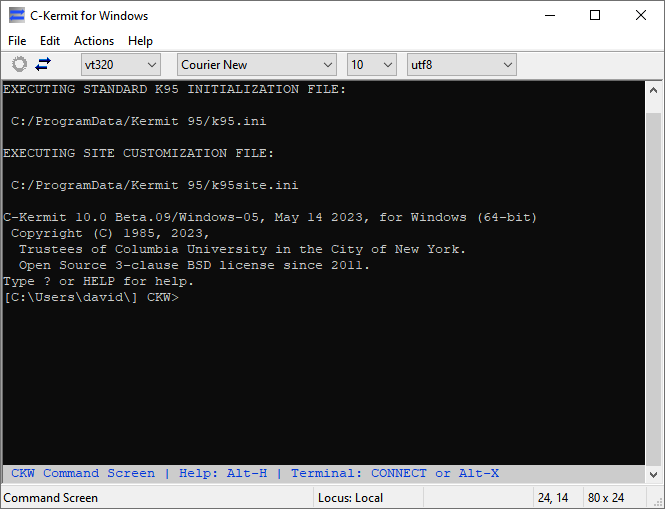

C-Kermit for Windows
====================

This is C-Kermit for Windows and OS/2. It is a free and open source version of the
program formerly known as Kermit-95, a commercial product of Columbia
University from 1994 to 2011. For more information on Kermit, visit the
Kermit Project website: http://www.kermitproject.org.

Major features include:
 * More than 40 terminal emulations
 * Virtual Terminal connections over SSH, Telnet (including TLS support), 
   rlogin, modem, serial port and pty
 * Scriptable file transfer via Kermit, HTTP, HTTPS, FTP and FTPS protocols
 * International character set translation
 * Pathworks supported for LAT and CTERM Virtual Terminal connections. 
   Can optionally be built with SuperLAT support as well (not enabled by
   default)

Windows XP or newer is required for SSH, secure telnet, https and ftps support.
Windows 10 version 1809 is required for PTY support.

This software is currently based on C-Kermit version 10.0 Beta.06 of
14-OCT-2022 and is available under the 3-clause BSD license.

New Features
------------

SSH Support is back in a limited way. Interactive sessions and file transfers
work but forwarding and some of the `set ssh` commands have not yet been
implemented. For more details, see the [SSH Readme](doc/ssh-readme.md).

PTYs are also supported on Windows 10+ now via the `pty` command. For example,
`pty cmd.exe` will open the Windows shell inside C-Kermit and from there you can
run any windows console tool. Note that Kermit file transfers are not supported
via this mechanism as Windows PTYs are not transparent. There may also be some
minor terminal emulation glitches as windows slots a terminal emulator in 
between the subprocess and CKW (Windows PTYs are not transparent).

The `pipe` command has also been fixed and kermit file transfers *are* supported
via this mechanism. Applications relying on the special Windows terminal APIs
won't work properly but anything that just outputs standard ANSI escape
sequences should work interactively. PuTTYs plink tool works as long as the
remote host is already trusted, and you use public key authentication.

Network DLLs are also fixed. You can now add support for additional protocols
via custom DLLs which are loaded with the `set network type dll` command.

Limited OS/2 Support is back. No network support and its now being built with
a totally different compiler, OpenWatcom, so bugs are very likely. As with
Kermit 95, the OS/2 version doesn't have a GUI - it runs in an OS/2 Console
Window. If you know anything about OS/2 programming, assistance in fixing the
remaining OS/2 issues would be most welcome.

SSL support is back and updated to support the latest versions of OpenSSL
and TLS.

The old Kermit 95 Dialer is back and rebranded as the C-Kermit for Windows
Dialer. Otherwise, it's the same old app for better or worse.

Features Expected to Return Soon
--------------------------------

* X/Y/Z Modem support - the author of the 3rd party library Kermit 95 used has
  OKd its open-sourcing so once that happens it will return.

Compiling
---------

To build C-Kermit for Windows, see the [Build Instructions](doc/building.md).
You'll need at least Visual C++ 2.0 or newer, or OpenWatcom 1.9+. To build
with ConPTY and SSH support you'll need to use Visual C++ 2019 or newer.

To build C-Kermit for OS/2, see the [OS/2 Build Instructions](doc/os2-building.md).

### Making Changes
Any files matching the pattern `ck[cu]*.[cwh]` are shared by implementations of 
C-Kermit for other platforms (UNIX, Linux, VMS, and others) and are not 
specific to the Windows and OS/2 port in this repository. Any changes to these 
files should be sent to [The Kermit Project](https://www.kermitproject.org/)
to be included in future C-Kermit releases for other platforms. If your changes
are not intended to affect other platforms, make sure they're ifdef'd for either
OS2 (OS/2+Windows) or NT (Windows only).

Files matching `ck[on]*.*` can be safely modified as they are only used by the 
OS/2 and Windows targets

The dialer data files (dialer.dat, registry.dat) are binary files edited by the
zinc designer. It's not possible to merge these files, so it's probably best to
get in touch before making changes to these files.

History
-------
C-Kermit for Windows is based on what was going to be Kermit 95 v2.2. Compared 
to the final K95 release (2.1.3) a number of bugs have been fixed and a few new
features were added for 2.2. A full list of these is available here:

http://www.kermitproject.org/k95-fixes-since-213.txt

Due to the way Kermit 95 was open-sourced, not all changes documented above for
Kermit 95 2.2 are included in C-Kermit for Windows. In particular, the version
of the Dialer included here comes from the Kermit 95 v2.1.3 codebase and so 
doesn't include any of the 2.2 enhancements. The original SSH subsystem was not
open-sourced so of course any listed SSH enhancements to that don't apply.

### Missing Kermit 95 Features
When Kermit 95 was open-sourced a number of features were disabled due to
obsolete 3rd party libraries, cryptography export regulations, or unavailability
of the required tools. Some of these may return someday, others likely will not.
This includes:

* Meridian SuperLAT support is available if you build C-Kermit for Windows 
  yourself. 
* Kerberos (provided by a very old version of MIT Kerberos for Windows)
* SRP (provided by the Stanford SRP distribution, unmaintained for over a decade now)
* Telnet Encryption Option

Other features may be missing as a result of the above features being disabled.
For a full list of features available, type the following at the Kermit prompt:

        SHOW FEATURES

Note that this may lie about some features being available due to them not being
disabled cleanly.
